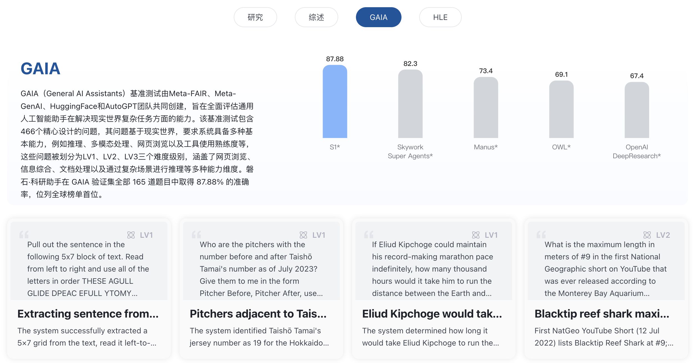

<h1 align="center">S1-Agent</h1>

  

   

  [English](README_EN.md) | 简体中文
  

# 📖 简介
**S1-Agent** 是“磐石”系列科学智能体的通用智能体框架，致力于构建具备强规划能力、工具调用能力和科学推理能力的多智能体系统。基于该框架，已经成功构建出如**磐石·文献罗盘（S1-Literature）** 与 **磐石·工具调度台（S1-ToolChain）** 等多种科研场景下的智能体应用平台，覆盖科研写作、知识检索、数据分析、选题评估、实验编排、文献综述等复杂任务流程。S1-Agent 在全球多个权威评测中表现优异，展现了其通用性、准确性与可扩展性。

S1-Agent 的核心设计理念是“多智能体协同 + 科学工具增强 + 历史记忆驱动”，通过模块化的规划、执行、校验与报告机制，使得系统能够稳健应对复杂任务中的中断、偏差和多轮调整。同时，框架支持快速集成科学工具，并具备语义记忆检索与任务复用能力，为科研人员提供了一套可控、可扩展、高性能的智能体构建基础。

## 🔥 更新
  - **[2025/07/26]** S1-Agent 正式发布，在全球权威通用智能体榜单中表现出色，其中 **GAIA (87.88)**，**SimpleQA (94.9)** ，**HLE (40.44)**，科学工具调用和科学推理能力领先。

## 🤖 智能体框架

S1-Agent 的核心在于构建了基于“规划-执行-反思”的多智能体交互协作框架，该框架整合了多种通用工具和科学工具，在全流程中添加历史记忆，通过模块化设计实现灵活扩展与高效协同工作。下图展示了系统内部的主要流程，及各智能体之间的信息传递与调用流程。

    

### 模块简介

- **规划智能体**：负责将用户提出的问题转化为明确的任务规划，制定解题路径并进行任务拆解。当执行过程中出现错误时，会结合历史记录动态调整方案，重新生成合理的子任务序列。
- **执行智能体**：根据规划结果，逐步完成每个子任务，包括文献检索、总结归纳、方法分析、图表解析等操作。支持多种科学工具调用，执行具备高度灵活性和上下文理解能力。
- **校验智能体**：自动评估执行结果是否符合预期，判断每一步是否成功完成当前子任务目标。如发现问题，可回溯相关历史并触发重新规划，确保任务流程的鲁棒性。
- **报告智能体**：汇总执行全过程及结果，输出结构化报告。支持 Markdown / HTML 等多种格式，便于用户直接引用或编辑使用。
- **记忆库**：存储历史任务、执行轨迹与策略，供各智能体实时调用。支持语义相似检索，增强系统的泛化与复用能力，是任务稳定执行的重要支撑模块。

## 🏆 权威榜单 

S1-Agent 在多个权威通用智能体评测基准上表现出色。在通用智能体任务榜单 [**GAIA**](https://arxiv.org/abs/2311.12983) 中以 **87.88** 分荣获第一名，大幅领先 [Skywork Super Agents](https://skywork.ai/home) 与 [OpenAI DeepResearch](https://openai.com/zh-Hans-CN/index/introducing-deep-research/) 等深度调研产品。在事实性问答任务榜单 [**SimpleQA**](https://cdn.openai.com/papers/simpleqa.pdf) 中，凭借 **94.9** 分暂居第一，展现出在知识对齐与精确检索方面的领先能力与强大性能。在关注封闭型推理任务的人类终极考试评测 [**HLE**](http://arxiv.org/abs/2501.14249) 中，以 **40.44** 分位列国际第二、国内第一名，仅次于 [Grok-4-Heavy](https://www.youtube.com/watch?v=MtYsUdfZPMA)，同时超过了包括 [Gemini](https://storage.googleapis.com/deepmind-media/gemini/gemini_v2_5_report.pdf)、[Kimi-Researcher](https://moonshotai.github.io/Kimi-Researcher/) 和 [X-Masters](https://arxiv.org/abs/2507.05241) 在内的多个主流框架与模型。

    

## 🎬 功能案例

以下科学案例展示了 S1-Agent 在科研写作与知识理解中的典型应用，覆盖综述撰写与科学问答等核心场景，帮助科研人员快速掌握领域进展、评估技术路径。

### 🧾 研究综述
 
> **用户提问：** 请帮我写一篇综述。  
> 标题：*Topological Insulators and Topological Superconductors*

📄 [点击查看完整研究综述案例](https://scienceone.ia.ac.cn/lit/#/share/1948672969641897985)

### 💡 科学问答

> **用户提问：** 请概述现代小分子药物研发的基本流程。一个候选药物进行了五次独立的辛醇-水分配系数（LogP）测量，得到的数值分别为：[2.1, 2.3, 2.0, 2.2, 2.4]。  
> 基于这些数据，该候选药物的亲脂性是否符合业界常用的 Lipinski 五规则的标准？其测量数据本身的可信度或一致性如何？

📄 [点击查看完整科学问答案例](https://scienceone.ia.ac.cn/lit/#/share/1947561271040053249)

## 🔭 未来规划

我们将持续迭代升级智能体框架 S1-Agent，并面向社区开源开放，近期计划包括：

- [ ] 发布 SuperGAIA 超级智能体复杂任务基准，深入剖析智能体的能力边界。
- [ ] 发布 S1-Agent 技术报告，详解智能体技术框架。

## 📬 欢迎体验

目前，S1-Agent 在 GAIA 及 HLE 等榜单的部分真实执行轨迹案例，已在磐石·文献罗盘平台开放展示。

    

我们诚挚欢迎广大科研人员、开发者和机构用户体验与反馈。您可以访问磐石·文献罗盘平台以试用产品功能、探索丰富案例，也欢迎通过 GitHub Issue 与我们交流建议与合作意向。

👉 磐石·文献罗盘：https://scienceone.ia.ac.cn/lit

