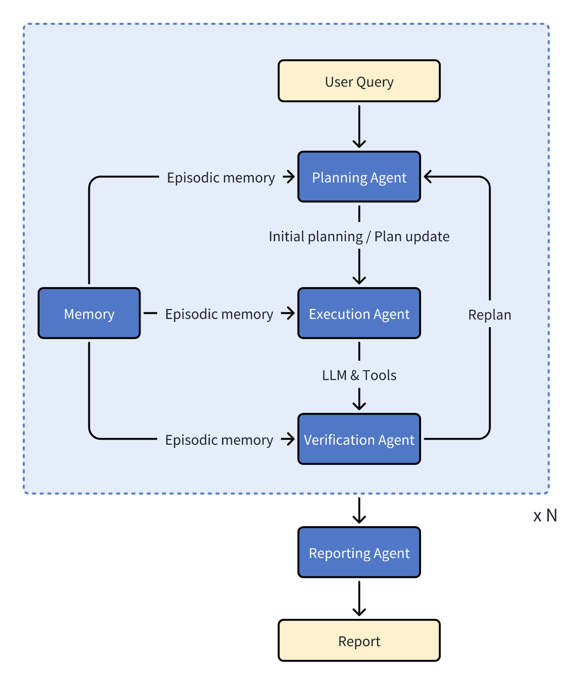
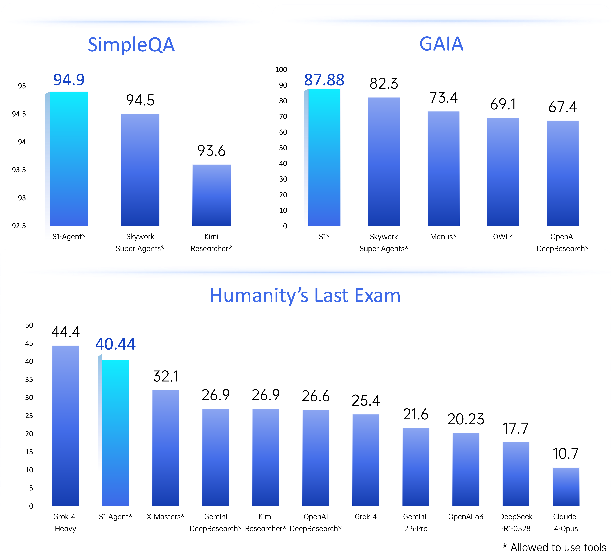
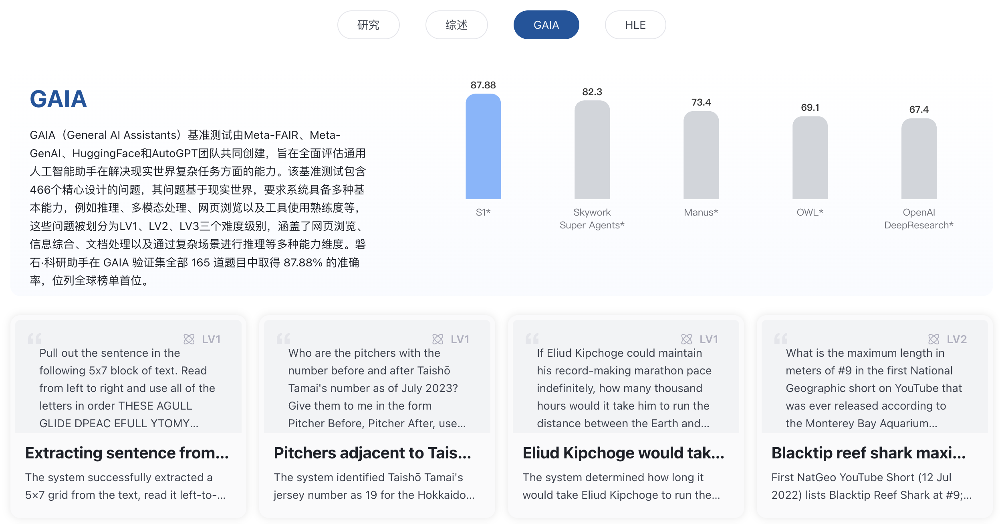

<h1 align="center">S1-Agent</h1>

  
  
  
  
   

  English | [简体中文](README.md)

# 📖 Introduction
**S1-Agent** is the universal intelligent agent framework of the "ScienceOne" series, dedicated to building multi-agent systems with strong planning, tool invocation, and scientific reasoning capabilities. Based on this framework, platforms such as **S1-Literature** and **S1-ToolChain** have been successfully developed, covering complex scientific tasks like academic writing, knowledge retrieval, data analysis, topic evaluation, experiment orchestration, and literature review. S1-Agent has performed excellently in multiple global authoritative evaluations, demonstrating its versatility, accuracy, and scalability.

The core design philosophy of S1-Agent is "multi-agent collaboration + scientific tool enhancement + history-driven memory". Through modular planning, execution, verification, and reporting mechanisms, the system robustly handles interruptions, deviations, and multi-round adjustments in complex tasks. The framework supports rapid integration of scientific tools and features semantic memory retrieval and task reuse, providing researchers with a controllable, extensible, and high-performance foundation for building intelligent agents.

## 🔥 Updates
  - **[2025/07/26]** S1-Agent officially released, achieving outstanding results in global general agent rankings, including **GAIA (87.88)**, **SimpleQA (94.9)**, **HLE (40.44)**, leading in scientific tool invocation and scientific reasoning capabilities.

## 🤖 Agent Framework

The core of S1-Agent is a "plan-execute-reflect" multi-agent interactive collaboration framework, integrating various general and scientific tools, and adding historical memory throughout the process. Modular design enables flexible expansion and efficient collaboration. The diagram below shows the main internal workflow and information transfer between agents.

    

### Module Overview

- **Planning Agent**: Translates user questions into clear task plans, formulates solution paths, and decomposes tasks. If errors occur during execution, it dynamically adjusts plans based on history and regenerates reasonable subtask sequences.
- **Execution Agent**: Completes each subtask step by step according to the plan, including literature retrieval, summarization, method analysis, chart interpretation, etc. Supports various scientific tool invocations, with high flexibility and contextual understanding.
- **Verification Agent**: Automatically evaluates whether execution results meet expectations and whether each step successfully achieves the current subtask goal. If issues are found, it can trace relevant history and trigger replanning to ensure process robustness.
- **Reporting Agent**: Summarizes the entire execution process and results, outputting structured reports. Supports Markdown / HTML formats for easy citation or editing by users.
- **Memory Database**: Stores historical tasks, execution traces, and strategies for real-time agent access. Supports semantic similarity retrieval, enhancing system generalization and reuse, and is a key module for stable task execution.

## 🏆 Authoritative Rankings

S1-Agent has excelled in multiple authoritative general agent evaluation benchmarks. In the general agent task ranking [**GAIA**](https://arxiv.org/abs/2311.12983), it scored **87.88** to win first place, far ahead of [Skywork Super Agents](https://skywork.ai/home) and [OpenAI DeepResearch](https://openai.com/zh-Hans-CN/index/introducing-deep-research/). In the factual Q&A task ranking [**SimpleQA**](https://cdn.openai.com/papers/simpleqa.pdf), it leads with **94.9** points, demonstrating outstanding knowledge alignment and precise retrieval capabilities. In the human ultimate exam evaluation focused on closed reasoning tasks [**HLE**](http://arxiv.org/abs/2501.14249), it ranks second internationally and first domestically with **40.44** points, just behind [Grok-4-Heavy](https://www.youtube.com/watch?v=MtYsUdfZPMA), and surpassing mainstream frameworks and models such as [Gemini](https://storage.googleapis.com/deepmind-media/gemini/gemini_v2_5_report.pdf), [Kimi-Researcher](https://moonshotai.github.io/Kimi-Researcher/), and [X-Masters](https://arxiv.org/abs/2507.05241).

    

## 🎬 Case Studies

The following scientific cases demonstrate S1-Agent's typical applications in academic writing and knowledge understanding, covering core scenarios such as review writing and scientific Q&A, helping researchers quickly grasp field progress and evaluate technical paths.

### 🧾 Research Review
 
> **User Question:** Please help me write a review.  
> Title: *Topological Insulators and Topological Superconductors*

📄 [Click to view the full research review case](https://scienceone.ia.ac.cn/lit/#/share/1948672969641897985)

### 💡 Scientific Q&A

> **User Question:** Please summarize the basic process of modern small molecule drug development. A candidate drug underwent five independent octanol-water partition coefficient (LogP) measurements, with values: [2.1, 2.3, 2.0, 2.2, 2.4].  
> Based on these data, does the lipophilicity of this candidate drug meet the industry standard of Lipinski's Rule of Five? How reliable or consistent are the measurement data themselves?

📄 [Click to view the full scientific Q&A case](https://scienceone.ia.ac.cn/lit/#/share/1947561271040053249)

## 🔭 Future Plans

We will continue to iterate and upgrade the S1-Agent framework and open source it to the community. Upcoming plans include:

- [ ] Release the SuperGAIA complex task benchmark for agents, deeply analyzing agent capability boundaries.
- [ ] Release the S1-Agent technical report, detailing the agent technology framework.

## 📬 Welcome to Experience

Currently, some real execution trace cases of S1-Agent in GAIA and HLE rankings are publicly displayed on the S1-Literature platform.

    

We sincerely welcome researchers, developers, and institutional users to experience and provide feedback. You can visit the S1-Literature platform to try product features and explore rich cases, and are also welcome to communicate suggestions and cooperation intentions via GitHub Issues.

👉 **S1-Literature** - https://scienceone.ia.ac.cn/lit